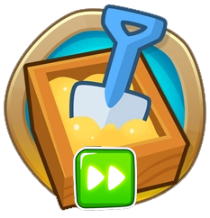

<h1 align="center">QuickGame</h1>

<h2>Modding Utility:</h2>

<h3>Loads into game immediately after Title Screen. No more clicking into sandbox mode over and over.</h3>

<h3>Change Game Mode and Difficulty in Mod Settings.</h3>

