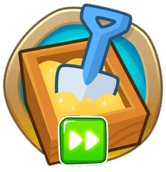

<h1 align="center">QuickGame</h1>

A small Bloons TD 6 modding utility from January 2023. It loads you straight into a game the moment the title screen finishes, skipping the menu clicking entirely. Game mode and difficulty are configurable in Mod Settings.

I built it out of iteration frustration. When you are developing a BTD6 mod, every rebuild means relaunching the game and clicking through the same menus to get into a match and test your change. Multiply that by a few hundred rebuilds and the menus become the slowest part of the toolchain. QuickGame deletes that step.

It was the first time I built a tool for my own development loop instead of for the end product, which turned out to be a habit worth keeping.

Requires [BTD6 Mod Helper](https://github.com/gurrenm3/BTD-Mod-Helper#readme).

